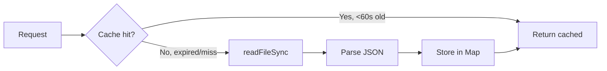

# Data Flow — Content Injection & Runtime Loading

**Status:** Current | **Last Validated:** 2026-05-07 | **Scope:** JSON loading, caching, type system, component data flow

---

## Architecture

```
Request → getServerSideProps()
            │
            ├── loadJSON(content/es.json)  ← Site content
            ├── loadJSON(nexa-pages/PAGE.json) ← Page config
            └── loadJSON(images.json) → .images  ← Image manifest
                        │
                        ▼
                React render (SSR)
                        │
              ┌──────────┼──────────┐
              │          │          │
         SECTION_MAP   data      images
         [26 components] prop     prop
```

## Loader System (src/lib/loader.ts)

### Simple API

```typescript
loadJSON(directory: string, filename: string): any
```

Takes two parameters (directory + filename) and returns parsed JSON.

### 60-Second TTL Cache



**Implementation:**

```typescript
interface CacheEntry { data: any; timestamp: number }
const cache = new Map<string, CacheEntry>()
const TTL = 60_000  // 60 seconds

export function loadJSON(dir: string, file: string): any {
  const fullPath = path.join(dir, file)
  const now = Date.now()
  const cached = cache.get(fullPath)
  if (cached && (now - cached.timestamp) < TTL) return cached.data
  try {
    const data = JSON.parse(fs.readFileSync(fullPath, 'utf-8'))
    cache.set(fullPath, { data, timestamp: now })
    return data
  } catch { return null }
}
```

The cache is **per-process, in-memory**. It survives between requests within the same Node.js process. On container restart or across multiple replicas, the cache starts cold.

## Data Sources (what gets loaded per request)

| File | Approx Size | Loaded In | Purpose |
|------|------------|-----------|---------|
| `content/es.json` | 100 KB | All pages | All text content, navigation, footer, SEO |
| `nexa-pages/*.json` | 1-3 KB each | Each page route | Section definitions, section order, content key references |
| `images.json` | 47 KB | All pages | Image manifest with src, alt, fallback chain |
| Total per request | ~150 KB | — | 3 file reads on cold cache |

## Content Resolution (src/components/content.ts)

### resolveContent(content, key)

Resolves a dot-separated key against the content object:

```typescript
resolveContent(content, 'home.hero')
// → content['home']['hero'] → { headline, subheadline, backgroundImage: "@img:hero.localizedEs", ... }

resolveContent(content, 'faqPage.full')
// → content['faqPage']['full'] → { title: "...", items: [{ q: "...", a: "..." }, ...] }
```

### resolveImage(images, ref)

Resolves `@img:` and `@src:` prefixed references through the images manifest:

```typescript
resolveImage(images, '@img:hero.localizedEs')
// → images['hero']['localizedEs']['src'] → '/images/hero/hero-es.webp'

resolveImage(images, '@src:team.operationsDirector')
// → images['team']['operationsDirector']['src'] → '/images/team/operations-director.webp'
```

Returns the `src` field of the manifest entry. If the key doesn't resolve, returns empty string.

## Type System (src/types.ts)

30+ TypeScript interfaces define the data contract between content JSON and components.

### Content Structure (SiteContent)

The top-level interface representing the entire `es.json`:

```typescript
interface SiteContent {
  siteName?: string
  navigation?: Navigation     // nav items, CTA
  footer?: Footer             // columns, social links, copyright
  home?: PageSectionContent   // hero, stats, trust, programs, etc.
  faqPage?: PageSectionContent
  blog?: { posts?: BlogPost[] }
  contactPage?: PageSectionContent
  aboutPage?: PageSectionContent
  // ... 15+ page sections
}
```

### Component Props (SectionComponentProps)

Every section component receives this prop shape:

```typescript
interface SectionComponentProps {
  variant?: string                  // visual variant name
  pageContent: Record<string, any>  // reconstructed {hero: {...}, stats: {...}}
  data?: any                        // exact section data directly
  images?: Record<string, any>      // images manifest
}
```

### Page Config (PageConfig)

Each `nexa-pages/*.json` file follows:

```typescript
interface PageConfig {
  slug?: string
  titleKey?: string           // for SEO title resolution
  descriptionKey?: string     // for SEO meta description
  sections?: PageSection[]    // ordered list of sections
  schemaType?: string          // JSON-LD schema type
}

interface PageSection {
  id: string                  // maps to SECTION_MAP key
  variant?: string            // visual variant
  content?: string            // dot-path to content in es.json
  enabledWhen?: string        // conditional rendering key
}
```

### Standardized Key Patterns

The type system normalizes different key names across content sources:

| Purpose | Primary Key | Fallbacks |
|---------|------------|-----------|
| Question | `q` | `pregunta`, `question`, `title` |
| Answer | `a` | `respuesta`, `answer`, `description`, `body` |
| Term | `term` | `q`, `title` |
| Definition | `definition` | `a`, `description`, `body` |
| Image ref | `src` | `imageUrl`, `image` |
| Member image | `memberImage` | `image`, `imageUrl` |
| Pillar item | `title` | — |
| Image URL | `src` | `fallbackSrc` |
| CTA text | `ctaText` | `buttonText` |
| CTA href | `ctaHref` | `buttonHref` |

## Data Injection Flow (per request)

```
1. User hits /faq
2. getServerSideProps runs:
   a. loadJSON(content/es.json) → fullContent
   b. loadJSON(nexa-pages/faq.json) → pageConfig
   c. loadJSON(images.json) → { images: {...} }
   d. Returns { content, pageConfig, images } to React
3. SlugPage renders:
   a. resolveContent(content, 'faqPage.seo') → page title + description
   b. pageConfig.sections.map(section => {
        id = 'faq' → SECTION_MAP['faq'] = FaqSection
        sectionData = resolveContent(content, 'faqPage.full')
        pageContent = { faq: sectionData }
        return <FaqSection pageContent={pageContent} data={sectionData} images={images} />
      })
4. FaqSection renders:
   a. Reads d = data || pageContent || {}
   b. d.items → 15 FAQ items with q/a
   c. Renders accordion UI
5. html sent to browser
```

## Deployment Impact

- **Standalone Docker**: 3 `loadJSON` calls per request, cached for 60s. 150KB memory per warm cache.
- **Multi-tenant builder**: Same pattern, but paths are prefixed with `/sites/nexa-paraguay/`.
- **Cache cold start**: First request after deploy reads all files fresh (~2ms each on SSD).
